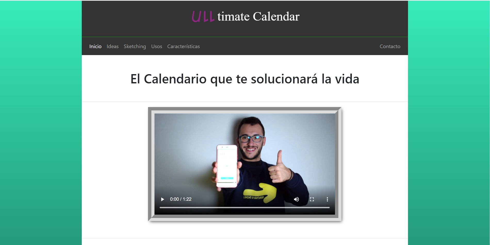
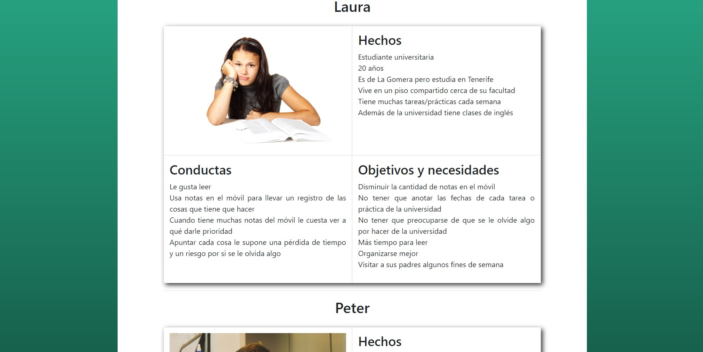

<h1 align="center">ULLtimate Calendar</h1>
<h4 align="center">Example of landing page using the web technologies HTML, CSS, Javascript, Bootstrap and Firebase.</h4>

    
  
  

## Website
The developed website is published in the [project webpage](https://angeligareta.com/ulltimate-calendar/).

## Screenshots

## Authors
- [Carlos Dominguez García](https://github.com/carlosdg)
- [Daute Rodríguez Rodríguez](https://github.com/DauteRR)
- Angel Igareta [angel@igareta.com](mailto:angel@igareta.com) 

## License
The Mit License.
